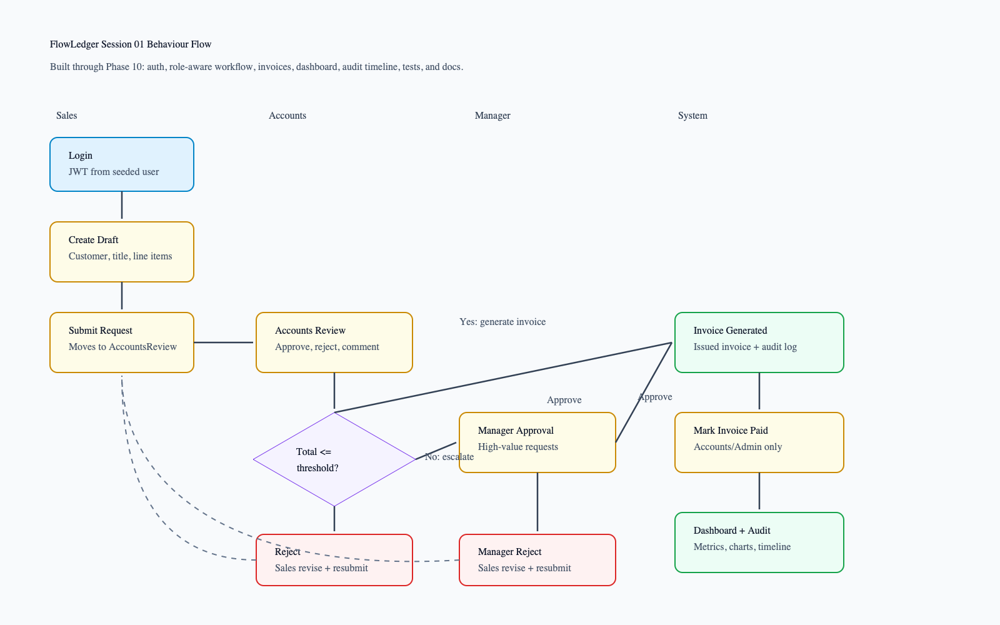

# FlowLedger

FlowLedger is an ERP-style billing approval and invoice workflow module. Sales creates billing requests, Accounts reviews them, Management approves high-value requests, and approved requests generate invoices with audit history and dashboard reporting.

## What I built

- ASP.NET Core 8 Web API with EF Core and SQL Server.
- React Vite TypeScript frontend with Tailwind, shadcn-style components, TanStack Query, Axios, React Hook Form, Zod, Lucide, and Recharts.
- JWT login with seeded demo users and role-based API/UI behavior.
- Billing request create, edit, submit, approve, reject, comment, invoice generation, payment marking, dashboard, and audit timeline.

## Selected option

Option 1: ERP Workflow Module.

## Demo credentials

Passwords are not committed. Set them in `.env` or shell environment variables.

| Role | Email | Password source |
|---|---|---|
| Sales | `sales@flowledger.local` | `SeedUsers__SalesPassword` |
| Accounts | `accounts@flowledger.local` | `SeedUsers__AccountsPassword` |
| Manager | `manager@flowledger.local` | `SeedUsers__ManagerPassword` |
| Admin | `admin@flowledger.local` | `SeedUsers__AdminPassword` |

## How to run with Docker

```bash
cp .env.example .env
```

Replace all placeholder values in `.env`, then run:

```bash
docker compose up --build
```

Open:

```text
Frontend: http://localhost:5173
Swagger: http://localhost:8080/swagger
Health: http://localhost:8080/health
SQL Server: localhost,14333
```

Stop and clear local data:

```bash
docker compose down -v --remove-orphans
```

## Local development without Docker

Requirements:

- .NET 8 SDK
- Node.js 22+
- SQL Server 2022 or compatible SQL Server instance

Backend:

```bash
cd backend
dotnet restore FlowLedger.sln
dotnet build FlowLedger.sln
dotnet test FlowLedger.sln
dotnet run --project FlowLedger.Api
```

Frontend:

```bash
cd frontend/flowledger-web
npm install
npm run dev
```

Set `ConnectionStrings__DefaultConnection`, `Jwt__Key`, and the `SeedUsers__*Password` values in user secrets, shell variables, or a local environment file. Do not commit real secrets.

## Key user flows

1. Sales logs in, creates a billing request, and submits it.
2. Accounts approves a request at or below the threshold, which generates an issued invoice.
3. Accounts approves a high-value request, which moves to Manager approval.
4. Manager approves the high-value request, which generates an issued invoice.
5. Accounts marks an issued invoice as paid.
6. Accounts or Manager rejects a request, and Sales revises and resubmits it.

## Architecture overview

The frontend calls the API through Axios and TanStack Query. The API exposes controller endpoints, delegates workflow behavior to application service interfaces, and stores data through EF Core with SQL Server. Services enforce workflow transitions and detailed permission checks; controllers stay thin.

## Backend structure

```text
backend/FlowLedger.Api/             Controllers, JWT, Swagger, CORS, DI
backend/FlowLedger.Application/     DTOs, service contracts, validators
backend/FlowLedger.Domain/          Entities, enums, workflow constants
backend/FlowLedger.Infrastructure/  EF Core, service implementations, seed data
backend/FlowLedger.Tests/           xUnit unit and integration tests
```

## Frontend structure

```text
frontend/flowledger-web/src/api/         API modules
frontend/flowledger-web/src/auth/        Login and auth context
frontend/flowledger-web/src/components/  Shared components and UI primitives
frontend/flowledger-web/src/layout/      App shell
frontend/flowledger-web/src/pages/       Dashboard, requests, invoices, customers, settings
frontend/flowledger-web/src/lib/         API client, permissions, formatting
```

## Data model overview

Main entities are `User`, `Customer`, `BillingRequest`, `BillingRequestLineItem`, `Comment`, `AuditLog`, `Invoice`, and `AppSetting`. Billing requests own line items, comments, audit logs, and at most one invoice. `AppSetting` currently stores configurable JWT access-token lifetime.

## Agent build sessions

Build-session artifacts are kept under `docs/agent-build-sessions/` so build plans, implementation logs, and generated behaviour snapshots stay separate from general project docs.

Current signed-off session:

- `docs/agent-build-sessions/01-initial-flowledger-build/erp_workflow_build_plan.md`
- `docs/agent-build-sessions/01-initial-flowledger-build/implementation-log.md`
- `docs/agent-build-sessions/01-initial-flowledger-build/session-flow.png`



## API overview

- `POST /api/auth/login`
- `GET /api/auth/me`
- `GET /api/customers`
- `GET /api/billing-requests`
- `POST /api/billing-requests`
- `GET /api/billing-requests/{id}`
- `PUT /api/billing-requests/{id}`
- `POST /api/billing-requests/{id}/submit`
- `POST /api/billing-requests/{id}/approve`
- `POST /api/billing-requests/{id}/reject`
- `POST /api/billing-requests/{id}/comments`
- `GET /api/invoices`
- `GET /api/invoices/{id}`
- `POST /api/invoices/{id}/mark-paid`
- `GET /api/dashboard/summary?periodMonths=1`

Swagger is available at `http://localhost:8080/swagger` when the API is running.

## Testing

Backend tests use xUnit, FluentAssertions, WebApplicationFactory, and Testcontainers SQL Server-backed integration tests.

```bash
cd backend
dotnet test FlowLedger.sln
```

Frontend tests and build:

```bash
cd frontend/flowledger-web
npm test
npm run lint
npm run build
```

When local `dotnet` is unavailable, backend verification can run through Docker:

```bash
docker run --rm -e TESTCONTAINERS_RYUK_DISABLED=true -e TESTCONTAINERS_HOST_OVERRIDE=host.docker.internal -v "$PWD:/src" -v /var/run/docker.sock:/var/run/docker.sock -w /src/backend mcr.microsoft.com/dotnet/sdk:8.0-alpine sh -lc 'dotnet test FlowLedger.sln --logger "console;verbosity=minimal"'
```

## Known limitations

- Mock seeded-user login instead of a real identity provider.
- JWT revocation is not implemented yet; see `docs/backlog.md`.
- No file attachments, email notifications, payment gateway, or PDF export.
- No admin UI for changing approval thresholds or app settings.
- Dashboard reporting is intentionally compact for the assignment scope.

## What I would improve with more time

- Add real identity provider integration and active session revocation.
- Add notification delivery for assigned approvals and rejections.
- Add attachments and generated invoice PDF export.
- Add configurable approval rules UI.
- Add route-level frontend code splitting if bundle size matters.
- Add CI pipeline with Docker Compose smoke tests.

## AI tools used and review process

AI was used to accelerate scaffolding, implementation, UI generation, and test drafting. The code was reviewed, simplified, adjusted to project constraints, and verified with backend tests, frontend tests, frontend build, Docker Compose runtime checks, and API workflow smoke tests.

Skills used during the build:

- `caveman`: kept assistant communication terse and implementation-focused.
- `ui-ux-pro-max`: guided frontend UI/UX design-system choices, dashboard/page structure, and visual QA checklist.
- `caveman-commit`: helped prepare concise Conventional Commit messages when commits were requested.

The project uses an agentic session hygiene pattern: every build session keeps its own plan, implementation log, and behaviour-flow image in a numbered directory. At sign-off, the agent reviews the latest log entries, updates reviewer-facing README details when the project materially changes, and refreshes `session-flow.png` so the final user journey is visible without reading the whole log.

See:

- `docs/design-note.md`
- `docs/deployment-security.md`
- `docs/agent-build-sessions/01-initial-flowledger-build/implementation-log.md`
